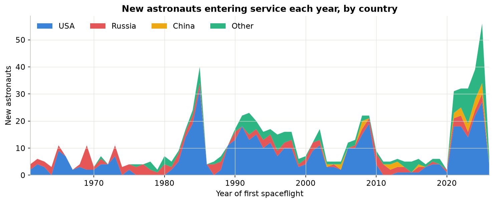
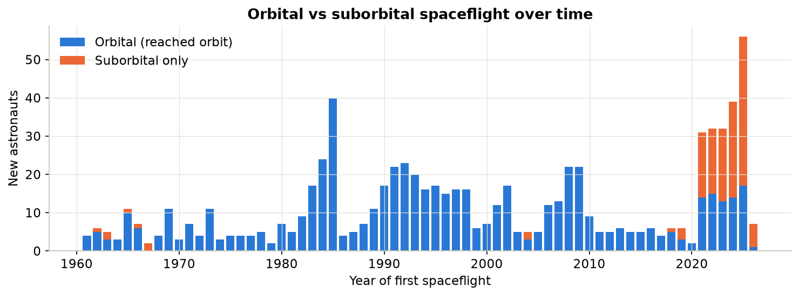
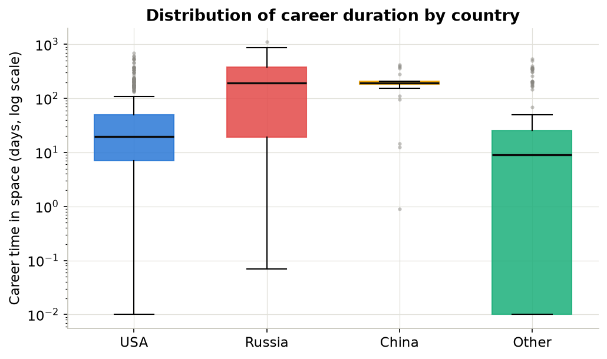
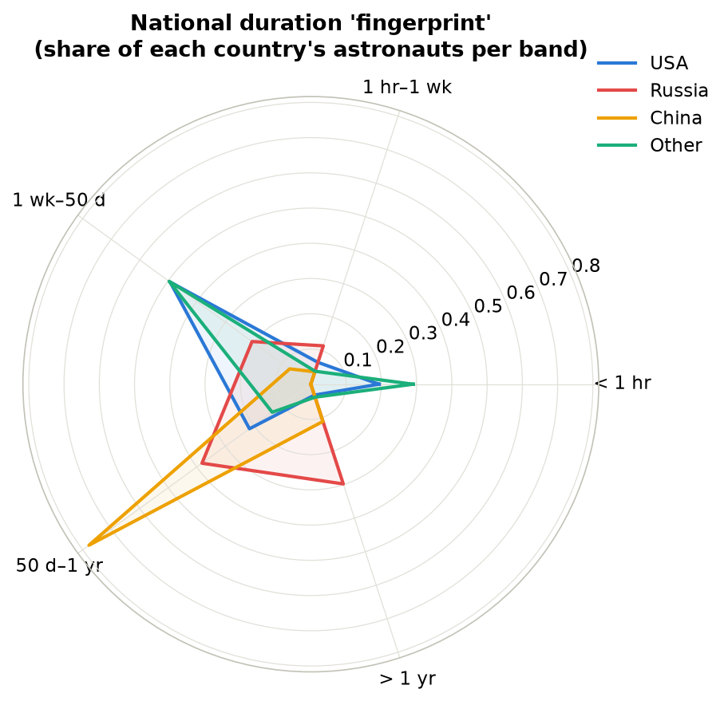

# 🚀 Astronaut Trends

**Six decades of human spaceflight — who has flown, from where, for how long, and how the mix has shifted from the Space Race to the commercial era.**

[](https://dr-richard-barker.github.io/Astronaut_trends/)
[](https://creativecommons.org/licenses/by/4.0/)
[](LICENSE)
[](https://planet4589.org/space/astro/lists/)

> 👉 **[Open the live interactive dashboard →](https://dr-richard-barker.github.io/Astronaut_trends/)**
> (13 linked, filterable, theme-aware visualisations — updated through **2026**.)

---

## What this repository is

This project takes the [Planet4589 General Catalogue of Astronauts](https://planet4589.org/space/astro/lists/) (maintained by Jonathan C. McDowell) and turns it into a **reproducible, updateable, and richly visualised analysis** of global human-spaceflight trends. It started life as a single R script and a static line chart; it is now a full data pipeline, a published dataset, and an interactive web dashboard.

Every person who has flown is counted in the **year of their first spaceflight**, grouped by **citizenship** (USA · Russia/USSR · China · Other) and by the **cumulative time they have spent in space** across their career, binned into five bands:

| Band | Meaning |
|---|---|
| **< 1 hour** | Suborbital hops (early test flights, modern space tourism) |
| **1 hour – 1 week** | Short orbital missions |
| **1 week – 50 days** | Typical Shuttle / short station visits |
| **50 days – 1 year** | Standard long-duration station increments |
| **> 1 year** | Cumulative career time exceeding one year aloft |

---

## 🎯 Goals & ideas

This README doubles as the project roadmap. Items marked ✅ are done in this release.

**Data & reproducibility**
- ✅ Rebuild the analysis from the **primary source** so it can be refreshed at any time (`scripts/build_dataset.py` fetches and reprocesses the live Planet4589 catalogues).
- ✅ Extend coverage from the original **1961–2024** snapshot to **1961–2026**.
- ✅ Publish tidy, documented, machine-readable datasets (`data/processed/`, with a [data dictionary](data/DATA_DICTIONARY.md)).
- ✅ Preserve the original R script and figure for provenance.
- ⬜ Add automated monthly refresh (GitHub Action) so the site tracks the source.
- ⬜ Unit tests / data-validation checks on the parser.

**Analysis — "better ways to look at it"**
- ✅ Distinguish **orbital vs suborbital** astronauts — a filter that reshapes *every* chart, plus a dedicated timeline. Reveals that the recent boom is almost entirely suborbital.
- ✅ Add **gender** as an analysis dimension (women's share over time).
- ✅ Analyse **career-duration distributions** (box-and-whisker) rather than just counts.
- ✅ Compare national **"duration fingerprints"** (radar) — each country has a distinct style.
- ✅ Show **flows** (country → duration band) and **relationships** (decade ↔ country) explicitly.
- ⬜ Age-at-first-flight and career-span analyses (the pipeline already extracts birth year).
- ⬜ Vehicle / programme breakdown (Shuttle vs Soyuz vs Shenzhou vs commercial).
- ⬜ Cumulative person-days-in-space by nation over time.

**Presentation & dissemination**
- ✅ Deploy an **interactive dashboard** as a GitHub Pages site.
- ✅ Provide **static figures** and a **summary report** for papers/slides.
- ✅ Package the repository for a **Zenodo** archival release with a DOI (`CITATION.cff`, `.zenodo.json`).
- ⬜ Short write-up / blog post interpreting the trends.

---

## 📊 Headline findings (this release)

*773 flown astronauts analysed, 1961–2026. Source snapshot generated automatically — see the dashboard footer for the exact date.*

- **The USA dominates by headcount** (460, ~60% of all flyers) but flies **short**: a median career of just **~20 days** in space.
- **Russia/USSR flies long**: 131 astronauts with a median career of **~195 days** and the single longest career on record (**> 1,100 days** cumulative).
- **China** (27 astronauts, all since **2003**) clusters in the **50 days – 1 year** band — a focused, station-oriented programme.
- **The 2020s are already the busiest debut decade ever** (199 new astronauts, vs 168 in the 1990s ISS build-up) — driven overwhelmingly by **suborbital commercial spaceflight** (the "< 1 hour" band explodes after 2021).
- **Orbital vs suborbital:** **637 (82%)** of all astronauts have reached orbit; **136 (18%)** are suborbital-only — and almost all of those are post-2021 Blue Origin / Virgin Galactic passengers. Russia and China have flown **zero** suborbital astronauts; the split is a US-and-partners phenomenon.
- **Women remain a minority**: just **14.7%** of all astronauts, a share that rises over time but has never approached parity.





<p align="center">
  
  
</p>

See [`docs/SUMMARY_TABLES.md`](docs/SUMMARY_TABLES.md) for the full numeric tables.

---

## 🖥️ The interactive dashboard

The [live site](https://dr-richard-barker.github.io/Astronaut_trends/) is filterable by **country** *and* by **flight class (orbital / suborbital / all)** — every chart re-renders for the selected population — and is theme-aware (light/dark):

0. **★ Orbital vs suborbital over time** — the featured chart; always shows both classes
1. **Stacked timeline** — new astronauts per year by country (zoomable)
2. **Small multiples** — the original study figure, rebuilt interactively (duration mix over time, per country)
3. **Box & whisker** — career duration by country
4. **Box & whisker** — career duration by decade
5. **Bar** — total astronauts by country
6. **100% stacked bar** — duration-band composition
7. **Sankey** — country → duration-band flows
8. **Chord** — decade ↔ country relationships
9. **Force-directed network** — country–decade bipartite graph
10. **Radar** — national duration "fingerprints"
11. **Heatmap** — decade × duration band
12. **Gender trend** — women in spaceflight over time
13. **Searchable summary table** — the full aggregated dataset

Charts are built with [ECharts](https://echarts.apache.org/) and [D3](https://d3js.org/), **vendored locally** (`docs/libs/`) so the archived version renders with no external network calls — important for long-term reproducibility and Zenodo archival.

---

## 🗂️ Repository structure

```
Astronaut_trends/
├── README.md                     ← you are here
├── LICENSE                       ← MIT (code)
├── CITATION.cff                  ← how to cite; drives Zenodo/GitHub metadata
├── .zenodo.json                  ← Zenodo archival metadata
├── CHANGELOG.md                  ← version history
├── CONTRIBUTING.md               ← how to contribute / refresh the data
├── requirements.txt              ← Python dependencies
├── data/
│   ├── raw/                      ← Planet4589 source snapshots (astro.html, missions.html)
│   ├── processed/                ← tidy, analysis-ready CSVs (regenerated by the pipeline)
│   ├── astronaut_summary_v1_2024.csv  ← the original 2024 summary (archived for provenance)
│   └── DATA_DICTIONARY.md        ← every field, defined
├── scripts/
│   ├── build_dataset.py          ← fetch + parse + bin + summarise (the pipeline)
│   ├── make_figures.py           ← static PNG figures + summary tables
│   └── mission_analysis_original.R    ← the original R analysis (preserved)
├── figures/                      ← generated PNGs + the original study figure
├── docs/                         ← the GitHub Pages site
│   ├── index.html                ← the interactive dashboard
│   ├── data/astronaut_data.json  ← data bundle the dashboard loads
│   ├── libs/                     ← vendored ECharts + D3
│   ├── SUMMARY_REPORT.md         ← narrative report
│   └── SUMMARY_TABLES.md         ← auto-generated tables
└── .github/workflows/pages.yml   ← auto-deploys docs/ to GitHub Pages
```

---

## 🔄 Reproduce / update the data

Everything downstream of the source is regenerated by two scripts.

```bash
# 1. Install dependencies (Python 3.9+)
pip install -r requirements.txt

# 2. Fetch the latest catalogues and rebuild all datasets + the dashboard JSON
python scripts/build_dataset.py           # add --offline to reprocess the cached snapshot

# 3. Regenerate the static figures and summary tables
python scripts/make_figures.py

# 4. Preview the dashboard locally
cd docs && python -m http.server 8097      # then open http://localhost:8097
```

`build_dataset.py` is the heart of the project: it downloads the fixed-width Planet4589 astronaut and mission lists, joins each astronaut to their missions to find their first-flight year, converts career durations to seconds, applies the five-band binning, cleans citizenship into four groups, and writes both the tidy per-astronaut table and every aggregate the dashboard needs.

**Methodology note:** the reprocessing faithfully reimplements the original R logic (`scripts/mission_analysis_original.R`), with two corrections — mission tags are parsed as *tag-before-slash, comma-separated* (robust to role suffixes), and only the *Flown Astronauts* section of the catalogue is used (chimpanzee and aborted-launch entries are excluded).

---

## 📚 Data source & citation

All underlying data is from **Jonathan C. McDowell's General Catalogue of Astronauts**:

- Astronauts: <https://planet4589.org/space/astro/lists/astro.html>
- Missions: <https://planet4589.org/space/astro/lists/missions.html>
- Project index: <https://planet4589.org/jcm/index.html>

Please credit Planet4589 for the source data. To cite **this** project, see [`CITATION.cff`](CITATION.cff) (GitHub renders a "Cite this repository" button in the sidebar).

---

## ⚖️ Licensing

- **Code** (scripts, dashboard) — [MIT](LICENSE).
- **Derived data & figures** — [CC-BY-4.0](https://creativecommons.org/licenses/by/4.0/).
- **Underlying source data** — © Jonathan McDowell / Planet4589; used with attribution.

---

*Part of the MadWest Rocketry education & outreach programme. Contributions welcome — see [CONTRIBUTING.md](CONTRIBUTING.md).*
