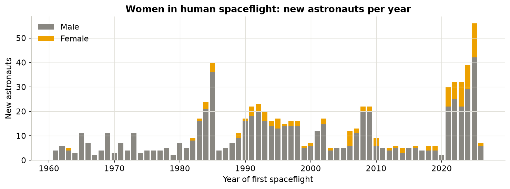

# Astronaut Trends — Research Report & Manuscript

*Six Decades of Human Spaceflight: A Reproducible Analysis of Global Participation, Career Duration, and the Commercial Inflection Point (1961–2026)*

**Dr. Richard Barker**  
*AstroBotany Laboratory, Department of Botany, University of Wisconsin–Madison*  
*MadWest Rocketry Education & Outreach Initiative*  
Source data: Jonathan McDowell, [Planet4589 General Catalogue of Astronauts](https://planet4589.org/space/astro/lists/).  
Interactive dashboard: [https://dr-richard-barker.github.io/Astronaut_trends/](https://dr-richard-barker.github.io/Astronaut_trends/)  
Downloads: [PDF Manuscript](Astronaut_Trends_Manuscript.pdf) · [Word Document (DOCX)](Astronaut_Trends_Manuscript.docx)

---

## Executive Summary

Over six decades since Yuriy Gagarin’s orbital flight in 1961, human spaceflight has expanded from a Cold War superpower contest to an international orbital station era, and now into an unprecedented commercial spaceflight expansion. This report analyzes **773 flown astronauts** spanning **1961 through 2026**, classified by year of maiden flight, nationality, cumulative career duration in space, orbital vs. suborbital flight class, and gender.

The dataset reveals **three distinct national operating paradigms** layered beneath a **commercial suborbital inflection point** in the 2020s:

1. **United States (Headcount Breadth)**: 460 astronauts (59.5% of global total), median career duration of **19.8 days**. Driven by large Shuttle crews and recent commercial suborbital hops.
2. **Russia / USSR (Long-Duration Endurance)**: 131 cosmonauts (16.9%), median career duration of **194.8 days** (nearly $10\times$ the US median) and the longest career on record (**1,110.6 cumulative days**, Oleg Kononenko).
3. **China (Focused Space Station Programme)**: 27 astronauts (3.5%, all since 2003), median career duration of **192.2 days** clustered in 6-month Tiangong expedition increments.
4. **Commercial & Suborbital Inflection**: **637 astronauts (82.4%)** achieved orbit, while **136 astronauts (17.6%)** flew exclusively suborbital—almost entirely post-2021 commercial passengers on Blue Origin and Virgin Galactic.
5. **Gender Representation**: Women represent **14.7% (114/773)** of all spacefarers, rising over time but remaining far below parity.

---

## 1. Global Flight Growth & Decadal Dynamics

Human spaceflight has progressed in distinct programme-driven waves:

| Decade | Total Debuts | USA | Russia / USSR | China | Other Nations |
|:---|---:|---:|---:|---:|---:|
| **1960s** | 53 | 32 | 21 | 0 | 0 |
| **1970s** | 47 | 19 | 22 | 0 | 6 |
| **1980s** | 129 | 89 | 22 | 0 | 18 |
| **1990s** | 168 | 111 | 21 | 0 | 36 |
| **2000s** | 120 | 86 | 13 | 6 | 15 |
| **2010s** | 57 | 19 | 17 | 5 | 16 |
| **2020s** | 199 | 104 | 15 | 16 | 64 |
| **Total** | **773** | **460** | **131** | **27** | **155** |

The 2020s has already surpassed the 1990s ISS build-up (168 debuts) to become the **busiest debut decade in history (199 astronauts)**, driven by commercial spaceflight resurgence.

---

## 2. National Operating Styles & Duration Fingerprints

| Country | Astronauts | Share | Median Career (Days) | Max Career (Days) |
|:---|---:|---:|---:|---:|
| **USA** | 460 | 59.5% | 19.8 | 695.3 |
| **Russia** | 131 | 16.9% | 194.8 | 1,110.6 |
| **China** | 27 | 3.5% | 192.2 | 418.6 |
| **Other** | 155 | 20.1% | 9.1 | 545.1 |

  
  

The radar "fingerprints" highlight the stark operational contrast: the US and Other partner cohorts bulge toward short duration bands, while Russia and China concentrate in long-duration expedition profiles ($> 50\text{ days}$).

---

## 3. The Commercial & Suborbital Transformation

| Duration Band | Time Threshold | Astronauts | Share |
|:---|:---|---:|---:|
| **less than 1 hour** | $< 3,600\text{ s}$ | 134 | 17.3% |
| **1 hour to 1 week** | $3,600\text{ s} \le T \le 7\text{ days}$ | 52 | 6.7% |
| **1 week to 50 days** | $7\text{ days} < T \le 50\text{ days}$ | 333 | 43.1% |
| **50 days to 1 year** | $50\text{ days} < T \le 365\text{ days}$ | 191 | 24.7% |
| **more than 1 year** | $> 365\text{ days}$ | 63 | 8.2% |

Suborbital spaceflight accounts for **136 astronauts (17.6%)**, of which 128 debuted post-2021. Russia and China have flown **zero** suborbital astronauts; the suborbital boom is concentrated in the US (91 astronauts, 19.8% of US total) and international commercial flyers (45 astronauts, 29.0% of Other total).

---

## 4. Women in Spaceflight

Women comprise **14.7% (114 of 773)** of all flown astronauts. Female debuts grew from 0 in the 1970s to 11 in the 1980s, 32 in the 1990s, 20 in the 2000s, 13 in the 2010s, and 38 in the 2020s.

---

## 5. Methodology & Open Science Data

- **Counting Rule**: Each individual is counted once in their maiden spaceflight year; duration is cumulative career time aloft.
- **Duration Bins**: $< 1\text{ hr}$, $1\text{ hr}–1\text{ wk}$, $1\text{ wk}–50\text{ d}$, $50\text{ d}–1\text{ yr}$, $> 1\text{ yr}$.
- **Cohorts**: USA, Russia (incl. USSR), China, Other Nations.
- **Pipeline**: Automated ingestion and tidying via `scripts/build_dataset.py` from Planet4589 raw snapshots.

*Full field definitions: [`data/DATA_DICTIONARY.md`](../data/DATA_DICTIONARY.md).*  
*Full manuscript: [`docs/MANUSCRIPT.md`](MANUSCRIPT.md).*
